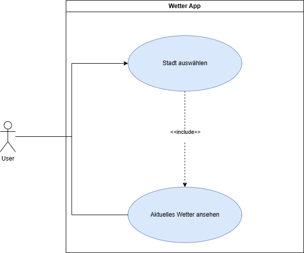
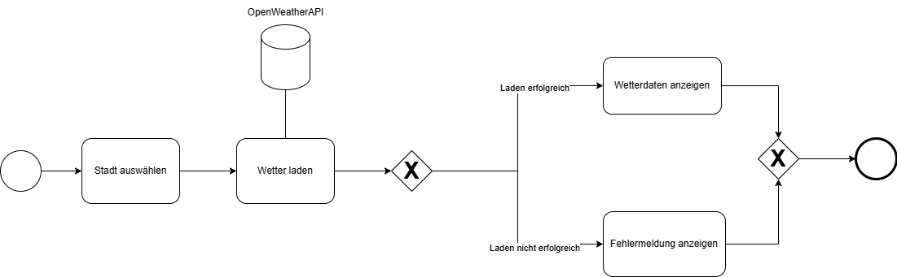

# Weather-App

Eine kleine VueJS App die uns aktuelle Wetterdaten zu einer Liste von Städten liefert. Der User wählt die gewünschte Stadt und die aktuellen Wetterdaten werden in einer InfoBox angezeigt.

## Use Case Diagramm

### Stadt auswählen

Vorbedingung: Die App wurde erfolgreich geladen.

<table>
<th>Schritt</th>
<th>Beschreibung</th>
<tr>
    <td>1. Selection öffnen</td>
    <td>Der User öffnet die Auswahl.</td>
</tr>
<tr>
    <td>2. Selection anzeigen</td>
    <td>Das System zeigt die Auswahl der verfügbaren Städte an.</td>
</tr>
<tr>
    <td>3. Stadt auswählen</td>
    <td>Der User wählt die gewünschte Stadt aus.</td>
</tr>
</table>

### Wetterdaten anzeigen

Vorbedingung: Die App wurde erfolgreich geladen. Die gewünschte Stadt wurde erfolgreich ausgewählt.

<table>
<th>Schritt</th>
<th>Beschreibung</th>
<tr>
    <td>1. Wetterdaten laden</td>
    <td>Das System lädt die Wetterdaten zur ausgewählten Stadt.</td>
</tr>
<tr>
    <td>2. Ladehinweis anzeigen</td>
    <td>Das System zeigt dem User einen Hinweis, dass die Daten geladen werden. Wenn die Daten nicht geladen werden können, wird mit Schritt 3.1 fortgefahren.</td>
</tr>
<tr>
    <td>3. Wetterdaten anzeigen</td>
    <td>Das System zeigt dem User die aktuellen Wetterdaten der ausgewählten Stadt an.</td>
</tr>
<tr>
    <td>3.1 Fehlermeldung anzeigen</td>
    <td>Das System zeigt dem User eine Fehermeldung an. Der Use Case endet hier.</td>
</tr>
</table>

## BPMN

## User-Story

_Als User_ 
_möchte ich aktuelle Wetterdaten zu meinem Ort sehen_ 
_damit ich einen Überblick über die aktuelle Wettersituation habe_

- Der User kann aus einer Liste verfügbarer Städte auswählen
- Die aktuellen Wetterdaten zu einer ausgewählten Stadt wird angezeigt.
- Wenn die Wetterdaten nicht geladen werden können, wird dem User mitgeteilt, dass die Daten nicht geladen werden konnten.
